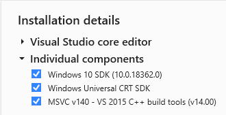

codonw
===========

CodonW is a package for codon usage analysis written by John Peden in
Paul Sharp's group (University of Nottingham).
It was originally designed to simplify multivariate analysis of codon usage
with other metrics related to codon usage calculated.


## Build and Installation

Come to root directory and run this:
```bash
python setup.py install
```
### Issues During Installing
# in Windows
1. LNK1158: cannot run 'rc.exe'  
   copy ```rc.exe``` and ```rcdll.dll``` from ```C:\Program Files (x86)\Windows Kits\10\bin\10.0.18362.0\x86``` to ```C:\Program Files (x86)\Microsoft Visual Studio 14.0\VC\bin```
2. fatal error C1083: Cannot open include file: 'basetsd.h': No such file or directory  
   Install win10 SDK in Visual Studio Installer.  
   There is my dependenceis in Visual Studio Installer looks like:  
   
3. error: Microsoft Visual C++ 14.0 is required  
   Install something Just as 2.
## Usage

The following metrics are available:

* codon adaptation index (CAI)
    - `CodonSeq.cai`
* frequency of optimal codons (Fop)
    - `CodonSeq.fop`
* codon bias index (CBI)
    - `CodonSeq.cbi`
* the effective number of codons (Nc)
    - `CodonSeq.enc`
* hydropathicity of protein
    - `CodonSeq.hydropathy`
* aromaticity score
    - `CodonSeq.aromaticity`
* Silent base composition (including GC3s)
    - `CodonSeq.silent_base_usage`
* Codon & Amino acid usage (count and relative)
    - `CodonSeq.codon_usage`
    - `CodonSeq.aa_usage`
    - `CodonSeq.rscu`
    - `CodonSeq.raau`
* Base composition by codon position
    - `CodonSeq.bases`
* Base composition in all frames,
    Length of gene,
    Number of synonymous codons,
    G+C content (overall and by codon position),
    G+C content of synonymous codons at the 3rd position,
    G+C content of non-synonymous codons at the 3rd position,
    Number of synonymous codons,
    Number of amino acids
    - `CodonSeq.bases2`
* Dinucleotide count by frame
    - `CodonSeq.dinuc`

As written above, each is a method of the `codonw.CononSeq` object, e.g.

```python
import codonw
cseq = codonw.CodonSeq("ATGAATATGCTCATTGTCGGTAGAGTTGTTGCTAGTGTTGGGGGAAGCGGACTTCAAACG")
cseq.cai()
```

The return type can be a simple value, `pd.Series`, or `pd.DataFrame`.

The genetic codes can be specified by setting the `CodonSeq.genetic_code`
property with a `pd.Series` whose index is a codon and value is the single
letter amino acid. Instantiate an object and see `CodonSeq.genetic_code`
for more details.

Some indicies have an option of reference values to choose from (e.g. `CodonSeq.fop`).
Several references values can be chosen by specifying the corresponding integer.
If you'd like to have user-provided reference values, please implement this
functionality and make a pull-request.

